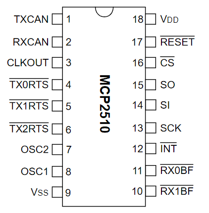

# Nathan's ReadMe

RF go real fast fr fr

### CAN IC notes:
IC Pin Schematic

#### Three transmit buffers:
Note: *Each are 14 bytes each*
*Check datasheet for informations on registers*

Questions for the current CAN controller drivers:
- Q: How is transmit initiated? Is it The TXnRTS pins or use  the SPI bus to the TXNnCTRL register

- Q: Where do we handle transmit priority? Controller or the MCU code?

- Q: What happens when all the buffers are filled? Do we lose it?

- Q: CAN IC initialization??????

- Q: 